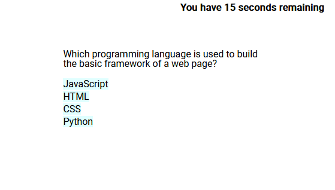
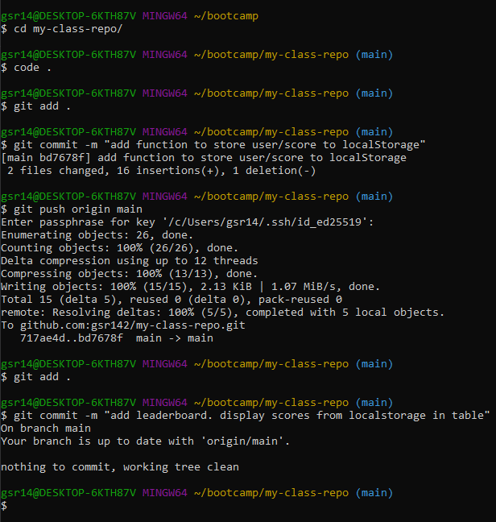

# Coding-Quiz

## Description

A short, timed, quiz website where users can test their programming knowledge by answering a series of questions.

## Features
* Multiple-choice questions: The website presents a series of multiple-choice questions to the users, allowing them to select one option as their answer.
* Timer: Each quiz has a time limit, and the website includes a countdown timer to track the remaining time. Incorrect answers are penalized by a time reduction.
* Scoring: Users earn points for each correct answer, and their final score is calculated at the end of the quiz.
* Leaderboard: The website maintains a leaderboard to display the top scores achieved by users.
* Local Storage: User scores and leaderboard data are stored in the browser's local storage, allowing users to resume their progress and view the leaderboard even after closing the website.

## Usage

* [Visit the site](https://gsr142.github.io/coding-quiz/)
* Answer as many questions as possible within the time limit.
* Enter your name to keep track of your scores.
* Try as many times as you'd like.

## Lessons Learned
* No sane person would volountarily navigate the DOM with the default commands.
* Pay attention to your bash windows or you'll think you're adding commits, when in reality you're updating your class activities repo. Like I did.

* Google-fu is my most important skill.

## Tools Used
* [HTML](https://developer.mozilla.org/en-US/docs/Web/HTML)
* [CSS](https://developer.mozilla.org/en-US/docs/Web/CSS)
* [JavaScript](https://developer.mozilla.org/en-US/docs/Web/javascript)
* [Git](https://git-scm.com/)
* [Google Fonts](fonts.google.com)

## Code Credit
* The reset.css file was taken from the UC Berkley Coding bootcamp lecture materials, from the section discussing CSS-resets. I did not author this file.
* I used a form of the sort function with arrow notation that I found on [this page](https://medium.com/coding-at-dawn/how-to-sort-an-array-numerically-in-javascript-2b22710e3958).

## Author
### Greg Richardson

## Contact
* gsr142@gmail.com
* [GitHub](https://github.com/gsr142)
* [LinkedIn](https://www.linkedin.com/in/gregory-richardson-7bb3a1280/)